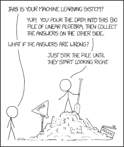

# Machine Learning Recipes

This is a collection of stand-alone Python examples of machine learning
algorithms. Run a specific recipe to see usage and result. Feel free to
contribute an example (recipe should be reasonably small, including usage).

### [Multi-armed bandit (MAB)](https://en.wikipedia.org/wiki/Multi-armed_bandit)

* **Epsilon greedy** ([recipes/MAB/greedy.py](recipes/MAB/greedy.py))
  > Sutton, Richard S., Barto, Andrew G. "Reinforcement Learning: An
  > Introduction", MIT Press, Cambridge, MA (1998).

* **Softmax** ([recipes/MAB/softmax.py](recipes/MAB/softmax.py))
  > Luce, R. Duncan. (1963). "Detection and recognition". In Luce, R. Duncan,
  > Bush, Robert. R. & Galanter, Eugene (Eds.), "Handbook of mathematical
  > psychology" (Vol. 1), New York: Wiley.

* **Thompson sampling** ([recipes/MAB/thompson.py](recipes/MAB/thompson.py))
  > Thompson, William R. On the likelihood that one unknown probability exceeds
  > another in view of the evidence of two samples. Biometrika,
  > 25(3–4):285–294, 1933.  DOI: [10.2307/2332286](http://doi.org/10.2307/2332286)

* **Upper Confidence Bound** ([recipes/MAB/ucb.py](recipes/MAB/ucb.py))
  > Lai, T.L and Robbins, Herbert, "Asymptotically efficient adaptive
  > allocation rules", Advances in Applied Mathematics 6:1, (1985) DOI:
  > [10.1016/0196-8858(85)90002-8](http://doi.org/10.1016/0196-8858(85)90002-8)

### [Artificial Neural Network (ANN)](https://en.wikipedia.org/wiki/Artificial_neural_network)

* **Adaptive Resonance Theory** ([recipes/ANN/art.py](recipes/ANN/art.py))

  > Grossberg, Stephen (1987). Competitive learning: From interactive
  > activation to adaptive resonance, Cognitive Science, 11, 23-63.

* **Echo State Network** ([recipes/ANN/esn.py](recipes/ANN/esn.py))

  > Jaeger, Herbert (2001) The "echo state" approach to analysing and training
  > recurrent neural networks. GMD Report 148, GMD - German National Research
  > Institute for Computer Science.

* **Simple Recurrent Network** ([recipes/ANN/srn.py](recipes/ANN/srn.py))

  > Elman, Jeffrey L. (1990). Finding structure in time. Cognitive Science,
  > 14:179–211.

* **Long Short Term Memory** ([nicodjimenez/lstm](https://github.com/nicodjimenez/lstm))

  > Hochreiter, Sepp and Schmidhuber, Jürgen (1997) Long Short-Term Memory,
  > Neural Computation Vol. 9, 1735-1780

* **Multi-Layer Perceptron** ([recipes/ANN/mlp.py](recipes/ANN/mlp.py))

  > Rumelhart, David E., Hinton, Geoffrey E. and Williams, Ronald J. "Learning
  > Internal Representations by Error Propagation". Rumelhart, David E.,
  > McClelland, James L., and the PDP research group. (editors), Parallel
  > distributed processing: Explorations in the microstructure of cognition,
  > Volume 1: Foundation. MIT Press, 1986.

* **Perceptron** ([recipes/ANN/perceptron.py](recipes/ANN/perceptron.py))

  > Rosenblatt, Frank (1958), "The Perceptron: A Probabilistic Model for
  > Information Storage and Organization in the Brain", Cornell Aeronautical
  > Laboratory, Psychological Review, v65, No. 6,
  > pp. 386–408. DOI:[10.1037/h0042519](http://doi.org/10.1037/h0042519)

* **Kernel perceptron** ([recipes/ANN/kernel-perceptron.py](recipes/ANN/kernel-perceptron.py))

  > Aizerman, M. A., Braverman, E. A. and Rozonoer, L.. " Theoretical
  > foundations of the potential function method in pattern 
  > recognition learning.." Paper presented at the meeting of the
  > Automation and Remote Control,, 1964.

* **Voted Perceptron** ([recipes/ANN/voted-perceptron.py](recipes/ANN/voted-perceptron.py))

  > Y. Freund, R. E. Schapire. "Large margin classification using
  > the perceptron algorithm". In: 11th Annual Conference on
  > Computational Learning Theory, New York, NY, 209-217, 1998.
  > DOI:[10.1023/A:1007662407062](http://doi.org/10.1023/A:1007662407062)

* **Self Organizing Map** ([recipes/ANN/som.py](recipes/ANN/som.py))

  > Kohonen, Teuvo. Self-Organization and Associative Memory. Springer, Berlin,
  > 1984.

### [Markov Decision Process (MDP)](https://en.wikipedia.org/wiki/Markov_decision_process)

* **Value Iteration**  ([recipes/MDP/value-iteration.py](recipes/MDP/value-iteration.py))

  > Bellman, Richard (1957). "A Markovian Decision Process". Journal of
  > Mathematics and Mechanics. 6.

### [Dimensionality Reduction (DR)](https://en.wikipedia.org/wiki/Dimensionality_reduction)

* **Principal Component Analysis** ([recipes/DR/pca.py](recipes/DR/pca.py))

  > Pearson, K. (1901). "On Lines and Planes of Closest Fit to Systems
  > of Points in Space". Philosophical Magazine. 2 (11): 559–572.
  > DOI:[10.1080/14786440109462720](http://doi.org/10.1080/14786440109462720)

* **Eigenface** ([recipes/DR/eigenface.py](recipes/DR/eigenface.py))

  > M. Turk & A. Pentland (1991) Eigenfaces for Recognition.
  > Journal of cognitive neuroscience, 3(1): 71-86.
  > DOI:[10.1162/jocn.1991.3.1.71](https://doi.org/10.1162/jocn.1991.3.1.71)

* **Classical Multidimensional scaling** ([recipes/DR/classical_mds.py](recipes/DR/classical_mds.py))

  > W.S. Torgerson (1952) Multidimensional scaling: I. Theory and method
  > Psychometrika, 17: 401-419
  > DOI:[10.1007/BF02288916](https://doi.org/10.1007/BF02288916)

